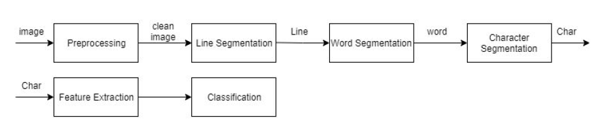

# Arabic OCR (Optical Character Recognition)
This project implements an Optical Character Recognition (OCR) system specifically for recognizing Arabic characters from scanned images. It utilizes machine learning models, including Support Vector Machines (SVM), Multi-layer Perceptron (MLP), and Naive Bayes classifiers, for accurate character recognition. The OCR process includes image preprocessing, segmentation, and classification, with evaluation metrics such as Word Error Rate (WER) and Character Error Rate (CER).



## Features
- **Preprocessing:** Converts images to grayscale, binarizes them, corrects skew, and expands images to improve recognition.
- **Segmentation:** Uses projection-based methods to segment images into lines and words, making it easier to process.
- **Character Recognition:** Trains multiple classifiers to recognize Arabic characters based on preprocessed images.
- **Evaluation:** Computes WER and CER to evaluate the performance of the OCR system.
- **Model Training:** Utilizes a dataset of Arabic characters to train and evaluate models for OCR.
- **Multiprocessing:** Supports parallel processing to speed up the OCR process when recognizing multiple words.

## Installation
1. Clone this repository to your local machine:
```bash
git clone https://github.com/KenanSh/Arabic-OCR-Scratch.git
cd Arabic-OCR-master
```
2. Install the required Python libraries:
```bash
conda env create -f environment.yml
conda activate arabicocr_scratch
```

## Dataset
The project uses an Arabic character dataset images attached as rar file with this repo and has this structure:
```
Dataset/
    ├── ا/
    ├── ب/
    ├── ت/
    ├── ث/
    └── ...
```
Each folder represents a different Arabic character and contains images of that character (in PNG format).

## Evaluation Metrics
The OCR system is evaluated using:

**Word Error Rate (WER):** Measures the accuracy of the word-level prediction.

**Character Error Rate (CER):** Measures the accuracy of the character-level prediction.

## Results
The model has been trained using various classifiers and evaluated on the dataset. Below are the performance scores for each classifier:

- **LinearSVM:** 98.91% accuracy
- **1L_NN (1 Layer Neural Network):** 99.53% accuracy
- **2L_NN (2 Layer Neural Network):** 99.68% accuracy
- **Gaussian Naive Bayes:** 85.07% accuracy

These results were obtained by training and testing the models on a dataset of Arabic characters. The 2 Layer Neural Network (2L_NN) performed the best with an accuracy of 99.68%.

## Contributing
Contributions are welcome! If you have any suggestions or improvements, please fork this repository and create a pull request.

## References
Here are useful papers for this task:
1. [A Survey of OCR in Arabic Language: Applications, Techniques, and Challenges](https://www.mdpi.com/2076-3417/13/7/4584)
2. [Printed Arabic Script Recognition: A Survey](https://www.researchgate.net/publication/327983209_Printed_Arabic_Script_Recognition_A_Survey)
3. [Neural Networks Pipeline for Offline Machine Printed Arabic OCR](https://www.researchgate.net/publication/320679094_Neural_Networks_Pipeline_for_Offline_Machine_Printed_Arabic_OCR)
4. [RECOGNITION OF ARABIC HANDWRITTEN CHARACTERS USING RESIDUAL NEURAL NETWORKS](https://www.researchgate.net/publication/351835426_RECOGNITION_OF_ARABIC_HANDWRITTEN_CHARACTERS_USING_RESIDUAL_NEURAL_NETWORKS?enrichId=rgreq-8a6b6d3a787acce4056fe22e24373bdb-XXX&enrichSource=Y292ZXJQYWdlOzM1MTgzNTQyNjtBUzoxMDcxMTUwMzE0NTU3NDQwQDE2MzIzOTM1NDQ5NzA%3D&el=1_x_3&_esc=publicationCoverPdf)